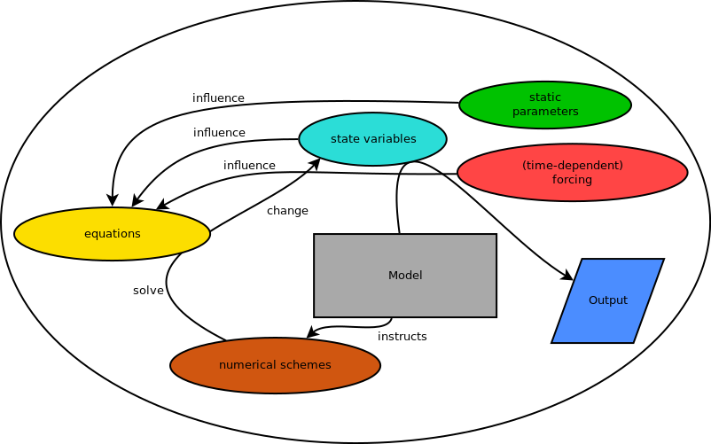

Basics
======

Basic structure
+++++++++++++++

The basic model structure is assumed the following:

- The model itself (:any:`NumericalModel`) knows: 
    - some metadata
    - the variables (:any:`SetOfStateVariables`)
    - the parameters (:any:`SetOfParameters`)
    - the forcing (:any:`SetOfForcingValues`)
    - the numerical schemes (:any:`SetOfNumericalSchemes`)
    - *[output facilities]*
- The numerical schemes (:any:`SetOfNumericalSchemes`) know:
    - the individual numerical schemes (:any:`NumericalScheme`) each for a
      specific equation (:any:`Equation`)
    - how to integrate their equations (:any:`NumericalScheme.integrate`)
- The equations (:any:`SetOfEquations`) know:
    - the equation variable (:any:`StateVariable`)
    - the equation input (:any:`SetOfInterfaceValues`) - which may contain other
      variables
    - how to calculate the equation (e.g. the linear and nonlinear part of a
      derivative)

   The basic model structure

