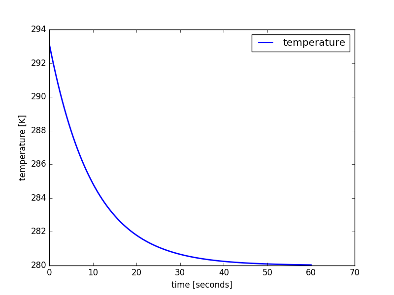

Examples
========

Linear decay equation
+++++++++++++++++++++

This is the full code from the :doc:`model-setup` section::

    # import the module
    import numericalmodel
    from numericalmodel.interfaces import *
    from numericalmodel.numericalschemes import *

    # create a model
    model = numericalmodel.numericalmodel.NumericalModel()
    model.initial_time = 0

    # define values
    temperature = StateVariable( id = "T", name = "temperature", unit = "K"  )
    parameter = Parameter( id = "a", name = "linear parameter", unit = "1/s"  )
    forcing = ForcingValue( id = "F", name = "forcing parameter", unit = "K/s" )

    # add the values to the model
    model.variables  = SetOfStateVariables( [ temperature  ]  )
    model.parameters = SetOfParameters(     [ parameter  ]    )
    model.forcing    = SetOfForcingValues(  [ forcing  ]      )

    # set initial values
    model.variables["T"].value  = 20 + 273.15
    model.parameters["a"].value = 0.1
    model.forcing["F"].value    = 28

    # define the equation
    class LinearDecayEquation(numericalmodel.equations.PrognosticEquation):
        """
        Class for the linear decay equation
        """
        def linear_factor(self, time = None ):
            # take the "a" parameter from the input, interpolate it to the given
            # "time" and return the negative value
            return - self.input["a"](time)

        def independent_addend(self, time = None ):
            # take the "F" forcing parameter from the input, interpolate it to
            # the given "time" and return it
            return self.input["F"](time)

        def nonlinear_addend(self, *args, **kwargs):
            return 0 # nonlinear addend is always zero (LINEAR decay equation)

    # create an equation object
    decay_equation = LinearDecayEquation(
        variable = temperature,
        input = SetOfInterfaceValues( [parameter, forcing] ),
        )

    # create a numerical scheme
    implicit_scheme = numericalmodel.numericalschemes.EulerImplicit(
        equation = decay_equation
        )

    # add the numerical scheme to the model
    model.numericalschemes = SetOfNumericalSchemes( [ implicit_scheme ] )

    # integrate the model
    model.integrate( final_time = model.model_time + 60 )

    # plot the results
    import matplotlib.pyplot as plt

    plt.plot( temperature.times, temperature.values, 
        linewidth = 2,
        label = temperature.name,
        )
    plt.xlabel( "time [seconds]" )
    plt.ylabel( "{} [{}]".format( temperature.name, temperature.unit ) )
    plt.legend()
    plt.show()

   The linear decay model results
