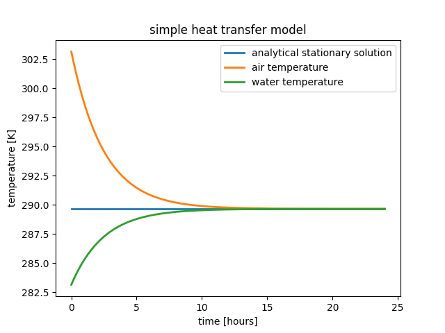

Examples
========

Linear decay equation
+++++++++++++++++++++

This is the full code from the :doc:`model-setup` section.

.. code::

    # import the module
    import numericalmodel
    from numericalmodel.interfaces import *
    from numericalmodel.numericalschemes import *

    # create a model
    model = numericalmodel.numericalmodel.NumericalModel()
    model.initial_time = 0

    # define values
    temperature = StateVariable( id = "T", name = "temperature", unit = "K"  )
    parameter = Parameter( id = "a", name = "linear parameter", unit = "1/s"  )
    forcing = ForcingValue( id = "F", name = "forcing parameter", unit = "K/s" )

    # add the values to the model
    model.variables  = SetOfStateVariables( [ temperature  ]  )
    model.parameters = SetOfParameters(     [ parameter  ]    )
    model.forcing    = SetOfForcingValues(  [ forcing  ]      )

    # set initial values
    model.variables["T"].value  = 20 + 273.15
    model.parameters["a"].value = 0.1
    model.forcing["F"].value    = 28

    # define the equation
    class LinearDecayEquation(numericalmodel.equations.PrognosticEquation):
        """
        Class for the linear decay equation
        """
        def linear_factor(self, time = None ):
            # take the "a" parameter from the input, interpolate it to the given
            # "time" and return the negative value
            return - self.input["a"](time)

        def independent_addend(self, time = None ):
            # take the "F" forcing parameter from the input, interpolate it to
            # the given "time" and return it
            return self.input["F"](time)

        def nonlinear_addend(self, *args, **kwargs):
            return 0 # nonlinear addend is always zero (LINEAR decay equation)

    # create an equation object
    decay_equation = LinearDecayEquation(
        variable = temperature,
        input = SetOfInterfaceValues( [parameter, forcing] ),
        )

    # create a numerical scheme
    implicit_scheme = numericalmodel.numericalschemes.EulerImplicit(
        equation = decay_equation
        )

    # add the numerical scheme to the model
    model.numericalschemes = SetOfNumericalSchemes( [ implicit_scheme ] )

    # integrate the model
    model.integrate( final_time = model.model_time + 60 )

    # plot the results
    import matplotlib.pyplot as plt

    plt.plot( temperature.times, temperature.values, 
        linewidth = 2,
        label = temperature.name,
        )
    plt.xlabel( "time [seconds]" )
    plt.ylabel( "{} [{}]".format( temperature.name, temperature.unit ) )
    plt.legend()
    plt.show()

.. figure:: graphics/linear-decay-model-result.png
   :alt: linear decay model results
   :align: center

   The linear decay model results

Heat transfer equation
++++++++++++++++++++++

This is an implementation of the heat transfer equation to simulate heat
transfer between two reservoirs:

.. math::
    c_1 m_1 \frac{dT_1}{dt} = - a \cdot ( T_2 - T_1 )

.. math::
    c_2 m_2 \frac{dT_2}{dt} = - a \cdot ( T_1 - T_2 )

.. code::
   
    # system module
    import logging

    # own modules
    import numericalmodel
    from numericalmodel.numericalmodel import NumericalModel
    from numericalmodel.interfaces import *
    from numericalmodel.equations import *
    from numericalmodel.numericalschemes import *

    # external modules
    import numpy as np
    import matplotlib.pyplot as plt

    logging.basicConfig(level = logging.INFO)

    model = NumericalModel()
    model.name = "simple heat transfer model"

    ### Variables ###
    temperature_1 = StateVariable(id = "T1", name = "air temperature",   unit = "K")
    temperature_2 = StateVariable(id = "T2", name = "water temperature", unit = "K")

    ### Parameters ###
    transfer_parameter = Parameter(
        id = "a", name = "heat transfer parameter", unit = "W/K")
    spec_heat_capacity_1 = Parameter(
        id = "c1", name = "specific heat capacity of dry air", unit = "J/(kg*K)")
    spec_heat_capacity_2 = Parameter(
        id = "c2", name = "specific heat capacity of water", unit = "J/(kg*K)")
    mass_1 = Parameter(id = "m1", name = "mass of air", unit = "kg")
    mass_2 = Parameter(id = "m2", name = "mass of water", unit = "kg")

    # add variables and parameters to model
    model.variables = \
        SetOfStateVariables( [temperature_1, temperature_2] )
    model.parameters = \
        SetOfParameters( [ transfer_parameter, spec_heat_capacity_1,
        spec_heat_capacity_2, mass_1, mass_2, ] )

    ### set initial values ###
    model.initial_time = 0
    temperature_1.value = 30 + 273.15
    temperature_2.value = 10 + 273.15
    mass_1.value = 20
    mass_2.value = 10
    spec_heat_capacity_1.value = 1005
    spec_heat_capacity_2.value = 4190
    transfer_parameter.value = 1.5

    ### define the heat transfer equation ###
    class HeatTransferEquation( PrognosticEquation ):
        """ 
        Heat transfer equation: 
            c1 * m1 * dT1/dt = a * ( T2 - T1 )
            c2 * m2 * dT2/dt = a * ( T1 - T2 )
        """
        def linear_factor( self, time = None ):
            v = lambda var: self.input[var](time)
            res = {
                "T1" : - v("a") / ( v("c1") * v("m1") ) ,
                "T2" : - v("a") / ( v("c2") * v("m2") ) ,
                }
            return res.get(self.variable.id,0)

        def nonlinear_addend( self, *args, **kwargs ):
            return 0

        def independent_addend( self, time = None ):
            v = lambda var: self.input[var](time)
            res = {
                "T1": v("a") * v("T2") / ( v("c1") * v("m1") ), 
                "T2": v("a") * v("T1") / ( v("c2") * v("m2") ), 
                }
            return res.get(self.variable.id,0)

    # define equation input
    equation_input = SetOfInterfaceValues( [ 
        temperature_1, temperature_2, transfer_parameter, spec_heat_capacity_1,
        spec_heat_capacity_2, mass_1, mass_2, 
        ])

    # set up equations
    transfer_equation_1 = \
        HeatTransferEquation( variable = temperature_1, input = equation_input )
    transfer_equation_2 = \
        HeatTransferEquation( variable = temperature_2, input = equation_input )

    ### numerical schemes ###
    model.numericalschemes = SetOfNumericalSchemes( [ 
        EulerExplicit( equation = transfer_equation_1 ),
        EulerExplicit( equation = transfer_equation_2 ),
        ] )

    # integrate the model
    model.integrate( final_time = model.model_time + 3600 * 24 )

    ### calculate the analytical stationary solution ###
    v = lambda var: equation_input[var].value
    stationary_temperature = \
        ( v("c1") * v("m1") * v("T1") + v("c2") * v("m2") * v("T2") ) \
        / ( v("c1") * v("m1") + v("c2") * v("m2") )

    logging.info("stationary solution: {}".format(stationary_temperature))
    logging.info("    air temperature: {}".format(temperature_1.value))
    logging.info("  water temperature: {}".format(temperature_2.value))

    ### Plot ###
    fig, ax = plt.subplots()
    ax.set_title(model.name)
    ax.plot( ( temperature_1.times.min()/3600, temperature_1.times.max()/3600 ),
             ( stationary_temperature, stationary_temperature ),
             linewidth = 2,
             label = "analytical stationary solution",
             )
    ax.plot( temperature_1.times/3600, temperature_1.values,
        linewidth = 2,
        label = temperature_1.name,
        )
    ax.plot( temperature_2.times/3600, temperature_2.values,
        linewidth = 2,
        label = temperature_2.name,
        )
    ax.set_xlabel( "time [hours]" )
    ax.set_ylabel( "temperature [{}]".format( temperature_1.unit ) )
    ax.legend()
    plt.show()

   heat transfer model results
