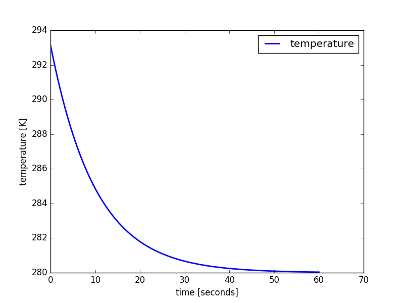

Setting up a model
++++++++++++++++++

We are going to implement a simple linear decay equation:

.. math::
    \frac{dT}{dt} = - a \cdot T + F

Where :math:`T` is the temperature in Kelvin, :math:`a>0` is the linear constant
and :math:`F` the forcing parameter.

To set up the model, some straight-forward steps are necessary. First,
import the :mod:`numericalmodel` module::

    import numericalmodel

Creating a model
----------------

First initialize an object of :any:`NumericalModel`::

    model = numericalmodel.numericalmodel.NumericalModel()

We may tell the model to start from time :math:`0`::

    model.initial_time = 0

Defining variables, parameters and forcing
------------------------------------------

The :any:`StateVariable`, :any:`Parameter`, and :any:`ForcingValue` classes all
derive from :any:`InterfaceValue`, which is a convenient class for time/value
management. It also provides interpolation (:any:`InterfaceValue.__call__`). An
:any:`InterfaceValue` has a (sensibly unique) :any:`id` for it to be
referencable in a :any:`SetOfInterfaceValues`.

For convenience, let's import everything from the :mod:`interfaces` submodule::

    from numericalmodel.interfaces import *

Let's define our state variable. For the simple case of the linear decay
equation, our only state variable is the temperature :math:`T`::

    temperature = StateVariable( id = "T", name = "temperature", unit = "K" )

Providing a name and a unit documents your model on the fly. 

.. tip:: All classes in :mod:`numericalmodel` are subclasses of
   :any:`ReprObject`. This makes them have a proper :any:`__repr__` method to 
   provide an as-exact-as-possible representation. So at any time you might do a
   ``print(repr(temperature))`` or just ``temperature<ENTER>`` in an
   interactive python session to see a representation of this object::

		numericalmodel.interfaces.StateVariable(
			unit = 'K',
			bounds = [-inf, inf],
			name = 'temperature',
			times = array([], dtype=float64),
			time_function = numericalmodel.utils.utcnow,
			id = 'T',
			values = array([], dtype=float64),
			interpolation = 'zero'
			)
    

The others - :math:`a` and :math:`F` - are created similarly::

    parameter = Parameter( id = "a", name = "linear parameter", unit = "1/s" )
    forcing = ForcingValue( id = "F", name = "forcing parameter", unit = "K/s" )

Now we add them to the model::

    model.variables  = SetOfStateVariables( [ temperature ] )
    model.parameters = SetOfParameters(     [ parameter ]   )
    model.forcing    = SetOfForcingValues(  [ forcing ]     )

.. note:: When an :any:`InterfaceValue`'s :any:`value` is set, a corresponding
   time is determined to record it. The default is to use the return value of
   the :any:`InterfaceValue.time_function`, which in turn defaults to the
   current utc timestamp. When the model was told to use ``temperature``,
   ``parameter`` and ``forcing``, it automatically set the
   :any:`InterfaceValue.time_function` to its internal :any:`model_time`. That's
   why it makes sense to define initial values **after** adding the
   :any:`InterfaceValue` s to the model.

Now that we have defined our model and added the variables, parameters and
forcing, we may set initial values::

    temperature.value = 20 + 273.15
    parameter.value   = 0.1
    forcing.value     = 28

.. tip:: We could also have made use of :any:`SetOfInterfaceValues`' handy
        indexing features and have said::

            model.variables["T"].value  = 20 + 273.15
            model.parameters["a"].value = 0.1
            model.forcing["F"].value    = 28
    
.. tip:: A lot of objects in :mod:`numericalmodel` also have a sensible
	``__str__`` method, which enables them to print a summary of themselves. For
	example, if we do a ``print(model)``::

		###
		### "numerical model"
		### - a numerical model -
		###  version 0.0.1
		###

		by:
		anonymous

		a numerical model
		--------------------------------------------------------------
		This is a numerical model.

		##################
		### Model data ###
		##################

		initial time: 0

		#################
		### Variables ###
		#################

		 "temperature"
		--- T [K] ---
		currently: 293.15 [K]
		bounds: [-inf, inf]
		interpolation: zero
		1 total recorded values

		##################
		### Parameters ###
		##################

		 "linear parameter"
		--- a [1/s] ---
		currently: 0.1 [1/s]
		bounds: [-inf, inf]
		interpolation: linear
		1 total recorded values

		###############
		### Forcing ###
		###############

		 "forcing parameter"
		--- F [K/s] ---
		currently: 28.0 [K/s]
		bounds: [-inf, inf]
		interpolation: linear
		1 total recorded values

		###############
		### Schemes ###
		###############

		none

Defining equations
------------------

We proceed by defining our equation. In our case, we do this by subclassing
:any:`PrognosticEquation`, since the linear decay equation is a prognostic
equation::

    class LinearDecayEquation(numericalmodel.equations.PrognosticEquation):
        """ 
        Class for the linear decay equation
        """
        def linear_factor(self, time = None ):
            # take the "a" parameter from the input, interpolate it to the given
            # "time" and return the negative value
            return - self.input["a"](time)

        def independent_addend(self, time = None ):
            # take the "F" forcing parameter from the input, interpolate it to
            # the given "time" and return it
            return self.input["F"](time)

        def nonlinear_addend(self, *args, **kwargs):
            return 0 # nonlinear addend is always zero (LINEAR decay equation)

Now we initialize an object of this class::

    decay_equation = LinearDecayEquation( 
        variable = temperature,
        input = SetOfInterfaceValues( [parameter, forcing] ),
        )

We can now calculate the derivative of the equation with the :any:`derivative`
method::

    >>> decay_equation.derivative()
    -28.314999999999998

Choosing numerical schemes
--------------------------

Alright, we have all input we need and an equation. Now everything that's
missing is a numerical scheme to solve the equation. :mod:`numericalmodel` ships
with the most common numerical schemes. They reside in the submodule
:mod:`numericalmodel.numericalschemes`. For convenience, we import everything
from there::

    from numericalmodel.numericalschemes import *

For a linear decay equation whose parameters are independent of time, the
:any:`EulerImplicit` scheme is a good choice::

    implicit_scheme = numericalmodel.numericalschemes.EulerImplicit( 
        equation = decay_equation
        )

We may now add the scheme to the model::

    model.numericalschemes = SetOfNumericalSchemes( [ implicit_scheme ] )

That's it! The model is ready to run!

Running the model
-----------------

Running the model is as easy as telling it a final time::

    model.integrate( final_time = model.model_time + 60 )

Model results
-------------

The model results are written directly into the :any:`StateVariable`'s cache.
You may either access the values directly via the :any:`values` property (a
:obj:`numpy.ndarray`) or interpolated via the :any:`InterfaceValue.__call__`
method.

One may plot the results with :mod:`matplotlib.pyplot`::

    import matplotlib.pyplot as plt

    plt.plot( temperature.times, temperature.values, 
        linewidth = 2,
        label = temperature.name,
        )
    plt.xlabel( "time [seconds]" )
    plt.ylabel( "{} [{}]".format( temperature.name, temperature.unit ) )
    plt.legend()
    plt.show()

   The linear decay model results

The full code can be found in the :doc:`examples` section.

